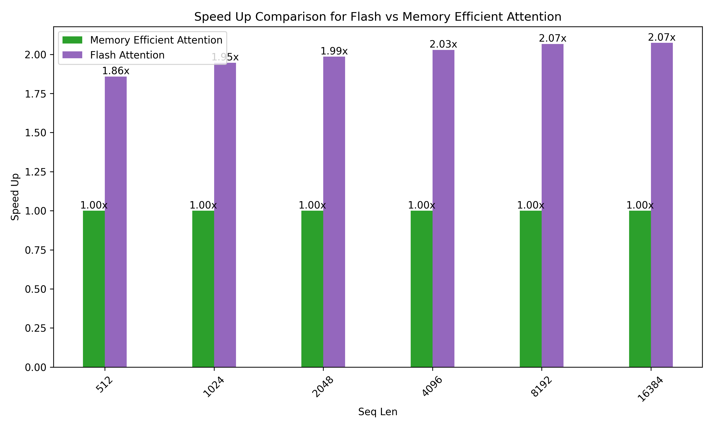
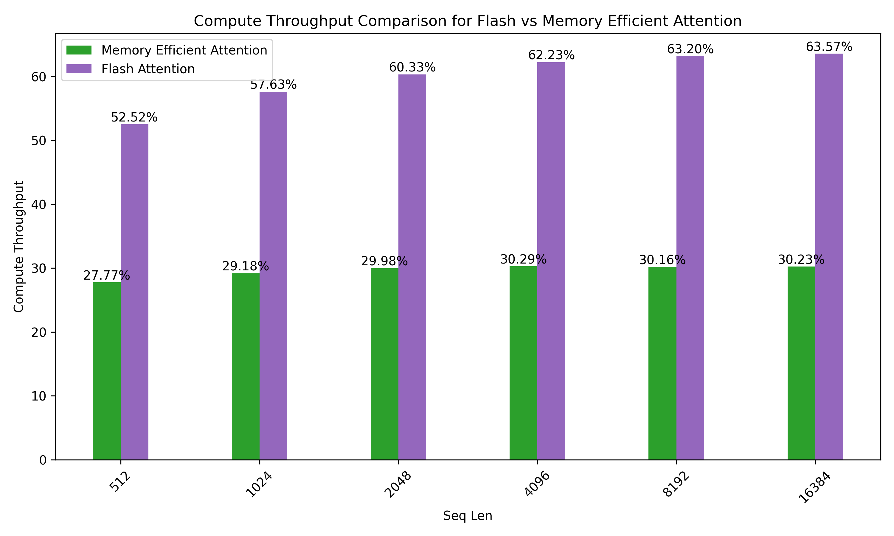

# FlashAttention Turing

This repository provides an implementation of [FlashAttention](https://github.com/Dao-AILab/flash-attention) for the Turing architecture. 

## Performance

We currently have benchmarks for T4.

We display FlashAttention speedup using these parameters:

 - Batch size 4
 - Sequence length 512, 1k, 2k, 4k, 8k, 16k
 - Number of heads 32
 - Head dimension 128

Our FlashAttention implementation is currently around 2x faster than Pytorch's [Attention](https://pytorch.org/docs/stable/generated/torch.nn.functional.scaled_dot_product_attention.html), which calls the Memory-Efficient Attention from [xformers](https://github.com/facebookresearch/xformers) for Turing GPUs. 



For long sequences our kernel reaches around 63% compute throughput.



## How to use FlashAttention
The main function implements scaled dot product attention (softmax(Q @ K^T * softmax_scale) @ V):

```
from flash_attn_turing import flash_attn_func
```
As this is an early implemention, currently we only support:
- ```head_dim = 128```
- vanilla attention i.e. no masking
- ```seq_len``` must be divisible by 128
```
flash_attn_func(q, k, v, batch_size, seq_len, num_heads, head_dim):
"""
Arguments:
    q:          (batch_size, seq_len, num_heads, head_dim)
    k:          (batch_size, seq_len, num_heads, head_dim)
    v:          (batch_size, seq_len, num_heads, head_dim)
    batch_size: int
    seq_len:    int
    num_heads:  int
    head_dim:   int
Return:
    out: (batch_size, seq_len, num_heads, head_dim).
"""
```


## Requirements
We tested this implemention on 
- PyTorch 2.5.1
- CUDA 12.4


